# Download and install java
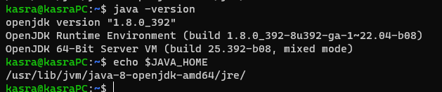

also to set the `JAVA_HOME` we used the following command:
```bash
export JAVA_HOME=$(readlink -f /usr/bin/java | sed "s:bin/java::")
```

# Download and install Scala
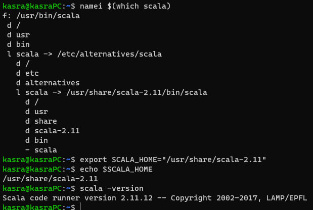

also, we could use this command to set the `SCALA_HOME`:
```bash
export SCALA_HOME=$(readlink -f /usr/bin/scala | sed "s:bin/scala::")
```

since `which scala` and `which scalac` works fine (they have links in `/usr/bin`), we dont need to add the `SCALA_HOME` to the `PATH`
but anyway, we can set it using the following command:
```bash
export PATH=$PATH:$SCALA_HOME/bin
```

# Download and install Hadoop
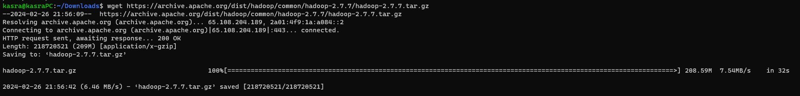

in the above commands, we downloaded the hadoop 2.7 from the official website and we can extracted it to `~/.hadoop` directory using the following command:
```bash
tar -xf hadoop-2.7.7.tar.gz
rm -rf ~/.hadoop
mkdir ~/.hadoop -p
mv hadoop-2.7.7/* ~/.hadoop
rmdir hadoop-2.7.7
```

to set the `HADOOP_HOME` and adding it to the `PATH` we used the following commands:
```bash
export HADOOP_HOME=~/.hadoop
export PATH=~/.hadoop/bin:$PATH
```

finally, to verify the installation:\
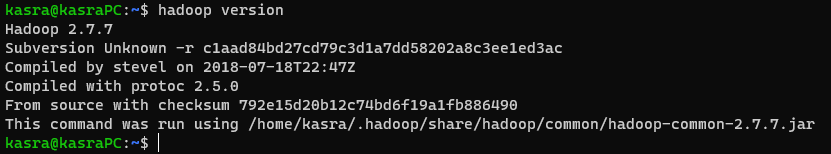

# Download and install Spark
download the spark 3.2.1:\
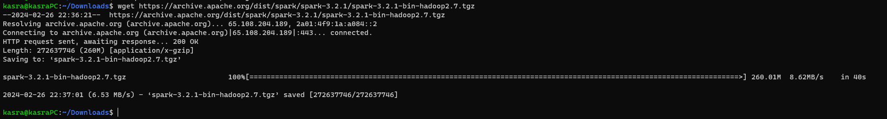

extract the spark to `~/.spark`:\
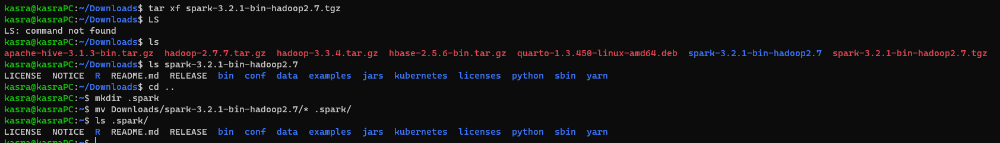

set the `SPARK_HOME` and add it to the `PATH`:
```bash
export SPARK_HOME=~/.spark
export PATH=~/.spark/bin:$PATH
```

finally, to verify the installation:\
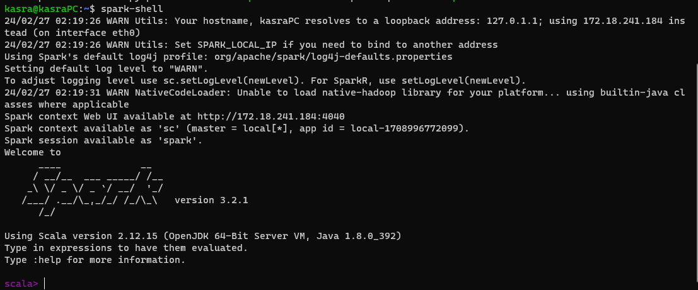

# Run the WordCount example in Apache Hadoop

to make a jar file using the codes, we need to compile the codes using the following command:
```bash
javac -classpath $(hadoop classpath) *.java
```

to verify the compliation:\
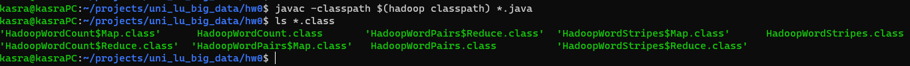

finally, to make a jar file:
```bash
jar cf wc.jar *.class
```

in this point we can delete the `.class` files to keep the directory clean:
```bash
rm *.class
```

Now we can use this command to run the `HadoopWordCount`:
```bash
hadoop jar HadoopWordCount.jar HadoopWordCount ~/data/wikipedia/enwiki-articles/AA/ output
```

to verify the output:\
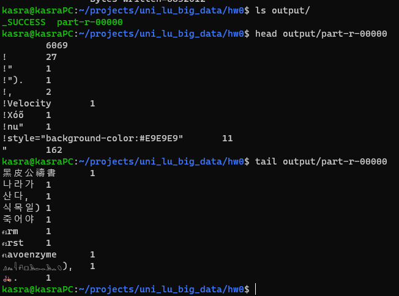

for the `HadoopWordPairs`:
```bash
rm -rf output
hadoop jar HadoopWordCount.jar HadoopWordPairs ~/data/wikipedia/enwiki-articles/AA/ output
```

to verify the output:\
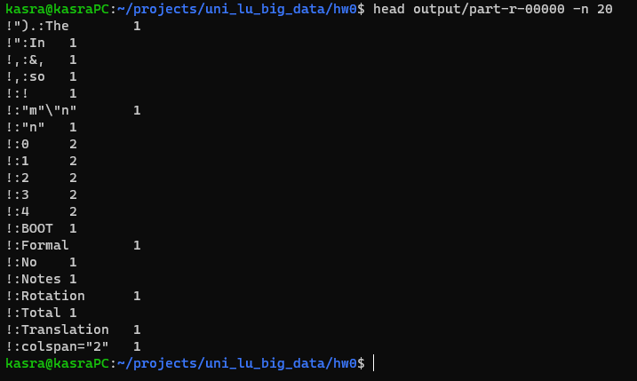


for the `HadoopWordStripes`:
```bash
rm -rf output
hadoop jar HadoopWordCount.jar HadoopWordStripes ~/data/wikipedia/enwiki-articles/AA/ output
```

to verify the output:\
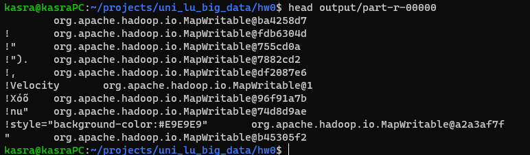


# Run the WordCount Example in Apache Spark

to run the `SparkWordCount` we need to install sbt using [here](https://www.scala-sbt.org/1.x/docs/Installing-sbt-on-Linux.html) 
and then we need a `build.sbt` file as follows:
```sbt
name := "Simple Project"

version := "1.0"

scalaVersion := "2.12.18"

libraryDependencies += "org.apache.spark" %% "spark-sql" % "3.5.0"
```

we need to make a directory structure as follows:
```
$ find src build.*
src
src/main
src/main/scala
src/main/scala/SparkWordCount.scala
build.sbt
```

and then we can use the following command to run the `SparkWordCount`:
```bash
sbt package
spark-submit --class SparkWordCount target/scala-2.12/simple-project_2.12-1.0.jar ~/data/wikipedia/enwiki-articles/AA/ output
```

to verify the output:\
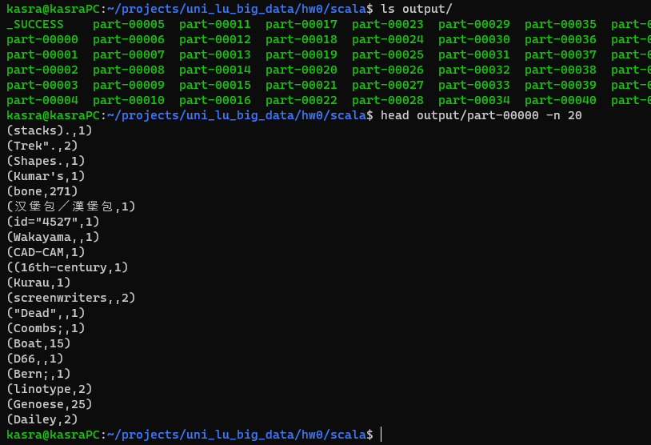

